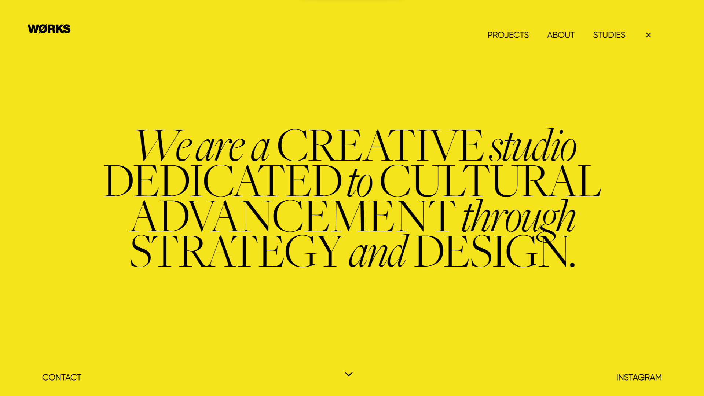

# WØRKS Studio Website UI-Clone

This project is a clone of the Works Studio website's user interface (UI), created using HTML, CSS, JavaScript, GSAP, and Locomotive.js. It aims to replicate the design and functionality of the original website while providing a learning opportunity for web development enthusiasts.

## Features

- **HTML Structure**: Replicates the layout and structure of the Works Studio website using semantic HTML elements.
- **CSS Styling**: Mimics the design of the original website using CSS for styling, including fonts, colors, spacing, and responsiveness.
- **JavaScript Interactivity**: Implements interactivity using vanilla JavaScript to add dynamic behaviors such as smooth scrolling, navigation functionality, and hover effects.
- **GSAP Animations**: Utilizes GSAP (GreenSock Animation Platform) to create engaging animations for transitions and scroll effects.
- **Locomotive.js Integration**: Integrates Locomotive.js for smooth scrolling functionality, ensuring a seamless user experience.
<!-- - **Responsive Design**: Ensures the website is responsive and works well on various devices and screen sizes through CSS media queries. -->

## Demo

[Live link](https://worksstudio-cloneproject.netlify.app/)

## Screenshots
1.Home-Page
<div align ="center">
  
</div>
2.Second - page
<div align ="center">
  
</div>
3.Third-page
<div align ="center">
  
</div>

## Installation

1. Clone the repository:

   ```HTTPS
   git clone https://github.com/AKSHAYRAM2003/Works.studio-clone.git

    ```SSH
    git clone git@github.com:AKSHAYRAM2003/Works.studio-clone.git
